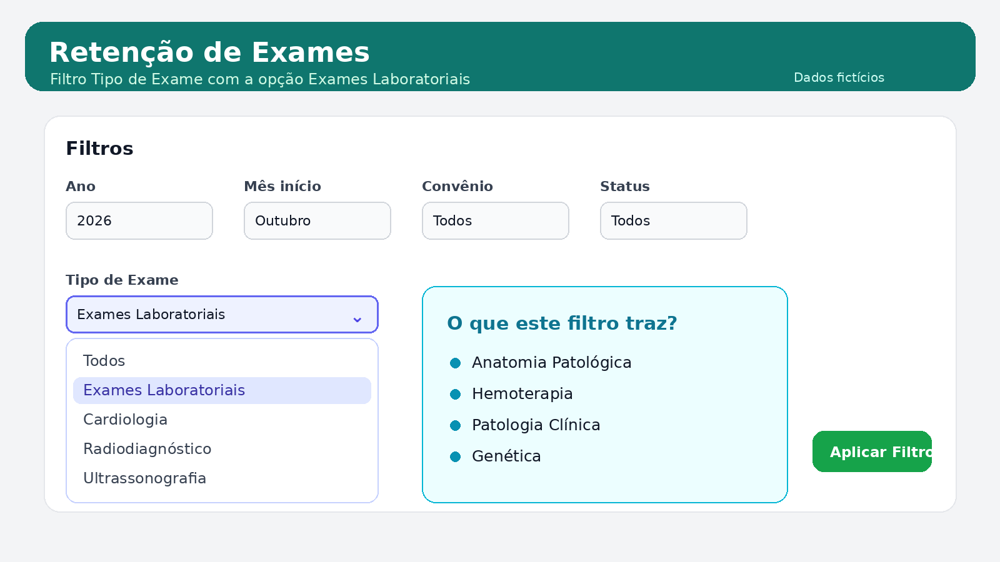
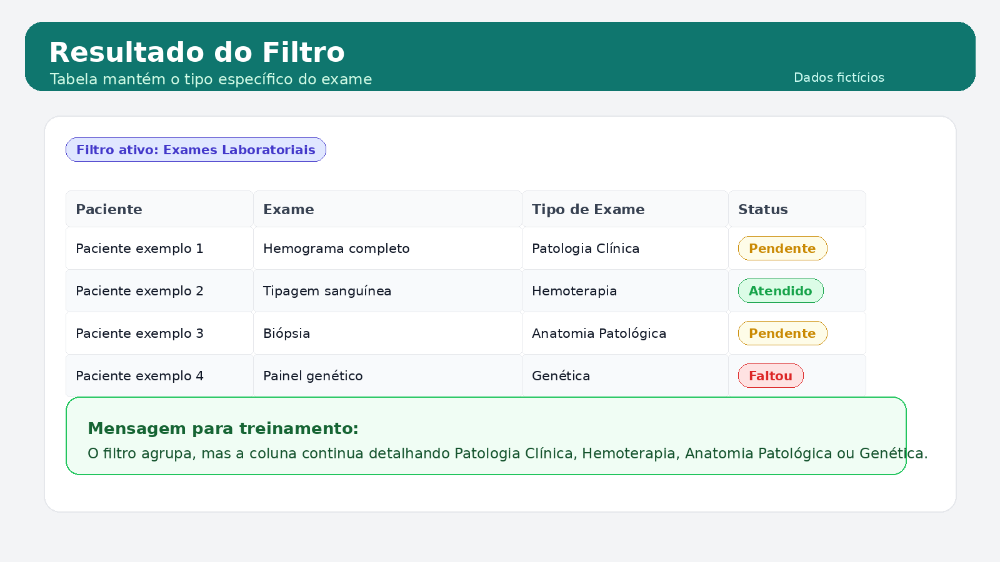
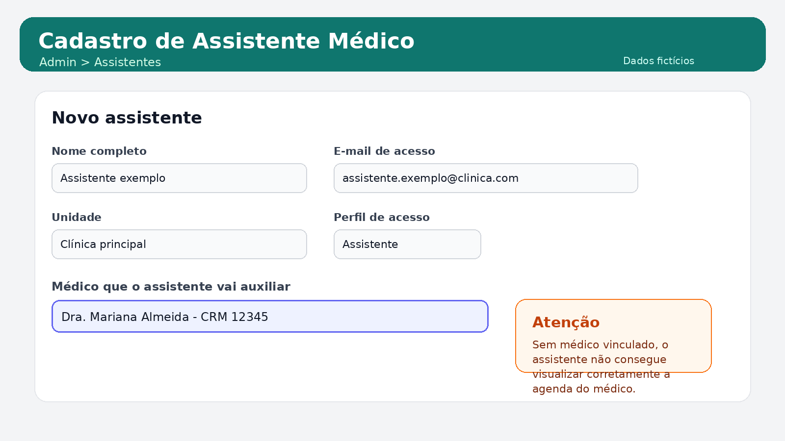
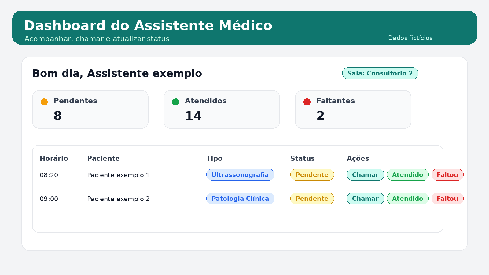

# Guia de Novas Funcionalidades

**Tema:** Exames Laboratoriais e Assistente Médico  
**Sistema:** Sistema Clínico MVP  
**Público-alvo:** funcionários responsáveis por treinar médicos, assistentes e equipe operacional  
**Data:** 05 de outubro de 2026  
**Branch de referência:** `main`

---

## 1. Objetivo

Este documento orienta a equipe interna sobre duas funcionalidades novas ou ajustadas no sistema:

- Agrupamento de exames laboratoriais no filtro `Tipo de Exame` da tela de retenção de exames.
- Fluxo operacional do perfil `Assistente Médico` no dashboard.

O material foi escrito para treinamento. Ele pode ser usado por funcionários que vão explicar a novidade aos médicos e assistentes.

> As imagens usadas neste guia são ilustrativas e usam dados fictícios. Não representam dados reais de pacientes.

---

## 2. Exames Laboratoriais no Filtro Tipo de Exame

### 2.1 Onde acessar

Perfil indicado: recepção, coordenação da recepção ou equipe autorizada.

Caminho no sistema:

`Recepção > Retenção de Exames`

Rota técnica:

`/recepcao/retencao-exames`

### 2.2 O que mudou

Antes, os tipos de exame apareciam separados no filtro e alguns nomes vinham com código na frente, por exemplo:

- `15 - Patologia Clínica`
- `24 - Ultrassonografia`

Agora:

- Os números e traços foram removidos dos nomes exibidos.
- O filtro ganhou a opção `Exames Laboratoriais`.
- Ao selecionar `Exames Laboratoriais`, o sistema traz apenas os exames dos quatro tipos laboratoriais definidos.

### 2.3 Tipos incluídos em Exames Laboratoriais

Quando o usuário seleciona `Exames Laboratoriais`, o sistema filtra estes quatro tipos:

- Anatomia Patológica
- Hemoterapia
- Patologia Clínica
- Genética

### 2.4 O que permanece separado

Os demais tipos continuam aparecendo separadamente no filtro, por exemplo:

- Medicina Nuclear
- Radiodiagnóstico
- Ultrassonografia
- Tomografia Computadorizada
- Ressonância Magnética
- Ecocardiograma com Doppler
- Eletroencefalografia
- Endoscopia Peroral
- Endoscopia Digestiva
- Fisioterapia
- Radioterapia
- Quimioterapia do Câncer
- Fonoaudiologia
- Alergologia
- Cardiologia
- Tisiopneumologia
- Exames Específicos
- Testes para Diagnósticos

### 2.5 Ponto importante para explicar ao usuário

O filtro agrupa os quatro tipos laboratoriais, mas a tabela continua mostrando o tipo específico do exame.

Exemplo:

- O usuário escolhe `Exames Laboratoriais` no filtro.
- A tabela mostra exames de `Patologia Clínica`, `Hemoterapia`, `Anatomia Patológica` e `Genética`.
- A coluna `Tipo de Exame` continua exibindo o nome específico, e não apenas o nome do grupo.

### 2.6 Como ensinar o uso

Passo a passo para treinamento:

1. Entrar na tela `Retenção de Exames`.
2. Conferir o período, médico, especialidade, convênio e status, se necessário.
3. Abrir o campo `Tipo de Exame`.
4. Selecionar `Exames Laboratoriais`.
5. Clicar em `Aplicar Filtros`, se o filtro ainda não tiver sido aplicado automaticamente.
6. Conferir se a tabela passou a listar apenas os exames laboratoriais.
7. Mostrar que cada linha continua informando o tipo específico do exame.

---

## 3. Assistente Médico

### 3.1 Objetivo da funcionalidade

O perfil `Assistente` permite que um funcionário acompanhe a agenda de exames vinculada a um médico específico e execute ações operacionais no dashboard.

O objetivo é apoiar a rotina do médico sem liberar acesso completo às telas clínicas do médico.

### 3.2 Como cadastrar um assistente

Perfil indicado para cadastro: administrador.

Caminho no sistema:

`Admin > Assistentes`

Rota técnica:

`/admin/assistentes`

Durante o cadastro, o administrador deve informar:

- Nome completo.
- Usuário/e-mail de acesso.
- Senha inicial.
- Unidade vinculada.
- Médico que o assistente vai auxiliar.

O campo mais importante é `Médico que o assistente vai auxiliar`. Sem esse vínculo, o assistente não consegue visualizar corretamente a agenda do médico.

### 3.3 Como o assistente acessa

O assistente faz login normalmente no sistema.

Após entrar, o sistema direciona o assistente para o dashboard operacional.

Rota principal:

`/dashboard`

### 3.4 O que o assistente pode fazer no dashboard

No dashboard, o assistente consegue:

- Ver os pacientes/exames vinculados ao médico auxiliado.
- Ver indicadores do dia, como pendentes, atendidos e faltantes.
- Chamar o paciente para o consultório ou sala configurada.
- Marcar um item como `Atendido`.
- Marcar um item como `Faltou`.
- Visualizar tipo de atendimento/exame e status.

### 3.5 O que o assistente não deve fazer

O assistente não substitui o médico no atendimento clínico.

Pontos importantes:

- O assistente tem acesso operacional ao dashboard.
- O assistente não deve acessar o atendimento médico completo como se fosse o médico.
- O assistente só deve operar itens pertencentes ao médico vinculado.
- O sistema bloqueia ações em agendas que não pertencem ao médico vinculado ao assistente.

### 3.6 Como ensinar o uso ao assistente

Passo a passo para treinamento:

1. Confirmar que o assistente foi cadastrado e está ativo.
2. Confirmar que ele está vinculado ao médico correto.
3. Fazer login com o usuário do assistente.
4. Selecionar a unidade, se o sistema solicitar.
5. Abrir o dashboard.
6. Conferir se os pacientes/exames exibidos são do médico vinculado.
7. Configurar ou conferir a sala/consultório.
8. Usar `Chamar` para chamar o paciente.
9. Usar `Atendido` quando o exame/atendimento operacional for concluído.
10. Usar `Faltou` quando o paciente não comparecer.

### 3.7 Cuidados no treinamento

Oriente a equipe a reforçar estes pontos:

- Sempre verificar a unidade ativa antes de operar a agenda.
- Conferir se o médico vinculado está correto no cadastro do assistente.
- Não compartilhar senha entre médico e assistente.
- Usar `Faltou` apenas quando houver confirmação operacional.
- Usar `Atendido` apenas após a realização ou conclusão do fluxo correspondente.

---

## 4. Roteiro Sugerido para Treinamento

### 4.1 Treinamento sobre exames laboratoriais

Fala sugerida:

> "Na tela de retenção de exames, os exames laboratoriais agora foram agrupados em um único filtro chamado Exames Laboratoriais. Quando selecionamos essa opção, o sistema traz somente Anatomia Patológica, Hemoterapia, Patologia Clínica e Genética. A tabela continua mostrando o tipo real do exame, para manter a informação detalhada."

### 4.2 Treinamento sobre assistente médico

Fala sugerida:

> "O assistente médico entra com o próprio usuário e acessa o dashboard operacional. Ele acompanha a agenda de exames do médico ao qual foi vinculado, pode chamar paciente, marcar como atendido ou faltou, mas não substitui o médico no atendimento clínico."

---

## 5. Perguntas Frequentes

| Pergunta | Resposta |
|---|---|
| Exames Laboratoriais mostra quais tipos? | Anatomia Patológica, Hemoterapia, Patologia Clínica e Genética. |
| A tabela muda o tipo para Exames Laboratoriais? | Não. A tabela continua mostrando o tipo específico do exame. |
| Os números dos nomes continuam aparecendo? | Não. Os rótulos foram ajustados para aparecer sem número e sem traço. |
| O assistente pode acessar o atendimento médico completo? | Não. O fluxo do assistente é operacional no dashboard. |
| O assistente vê a agenda de qualquer médico? | Não. Ele vê a agenda relacionada ao médico vinculado no cadastro. |
| O que fazer se a agenda não aparecer? | Verificar unidade ativa, vínculo com médico e CRM/configuração do médico. |

---

## 6. Evidência Técnica

Arquivos principais relacionados:

- `frontend/app/pages/recepcao/retencao-exames.vue`
- `frontend/app/utils/tuss.ts`
- `backend/src/services/retencao_exames_service.py`
- `backend/src/utils/tuss.py`
- `frontend/app/pages/dashboard.vue`
- `frontend/app/pages/admin/assistentes.vue`
- `frontend/app/components/UsuarioFormModal.vue`
- `frontend/app/middleware/auth.global.ts`
- `backend/src/modules/agenda/routes.py`
- `backend/src/services/spdata_atendimentos_service.py`

Validações executadas na implementação:

- Testes backend focados passaram.
- Typecheck do frontend passou.
